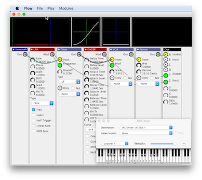

# Flow 
A Polyphonic Modular Additive Synthesizer (Version 0)
 
By Sean Luke (sean@cs.gmu.edu) \
With Help from Bryan Hoyle \
Copyright 2018 by George Mason University

I (Sean) have been asked where my Patreon page is.  So, sure, here's my <a href="https://www.patreon.com/SeanLuke">Patreon page</a>.

## About

Flow is a fully-modular polyphonic additive software synthesizer written in pure Java.  It runs on OS X, Linux, and Windows.
Flow is an academic research project, and this version is an early prerelease and should be expected to have bugs.  Please
let us know what you find.

Flow is in **prerelease**.  This means that changes will be made to it in successive versions which could be entirely non-backward
compatible.  These changes may and likely will break patches you made with earlier versions.  We make no guarantees of 
consistency at this stage.

Flow has about 50 modules of different shapes and sizes, and currently supports 8-16 voices at 128 partials and 44.1KHz with
 a rate of one new partial update every 32 samples.  Flow is a computationally expensive program and will keep your laptop 
quite warm and your fan busy.  You need to have some fairly good hardware to run Flow successfully (for reference, Flow was 
developed on a 2.8Ghz i7 2015 Macbook Pro Retina).

## Resources

* Flow has an [extensive manual](https://cs.gmu.edu/~eclab/projects/flow/flow.pdf) which discusses additive synthesis, Flow's modular approach, how to run it, how to integrate it with controllers and DAWs, and how to build new modules.

* One of Flow's modules is a wavetable synth.  It's designed to load wavetables built with WaveEdit, and there are [quite a number to choose from on their website.](https://waveeditonline.com/)

* Interested in helping out on Flow?  Our [To Do list](TODO.md) lists current open issues and bugs.

## Demos

## Install and Run Flow

Flow is cross-platform and will run on a variety of platforms (Windows, Linux) but we are personally developing on and for
OS X and Linux. We'd appreciate feedback and screenshots of it running on Windows so we can tweak things.

### Installation and Running on OS X 

First install Flow from this link: [Flow.app.zip](https://cs.gmu.edu/~eclab/projects/flow/Flow.app.zip). 
Sadly, it's a whopping 70MB because it includes the Java VM.  :-(

Sierra has really locked down the ability to run an application that's not from a commercial, paying Apple Developer.  And GMU is not one.  So you will have to instruct Sierra to permit Flow to run.

Let's assume you stuck Flow in the /Applications directory as usual.  Then:

1. Run the Terminal Program (in /Applications/Utilities/)
2. Type the following command and hit RETURN: `   sudo spctl --add /Applications/Flow.app`
4. Enter your password and hit RETURN.
5. Quit the Terminal Program

Now you should be able to run Flow.  Let us know if this all works.

### Installation and Running on Windows

The following should work (but has not been tested):

1. [Download and install Java 9](https://www.oracle.com/technetwork/java/javase/downloads).  The JRE should work fine.

2. Download Flow's jar file, called [flow.jar](https://cs.gmu.edu/~eclab/projects/flow/flow.jar).

3. Double-click on flow.jar to launch Flow.

#### Note

Flow makes heavy use of Java preferences.  There is a longstanding Java/Windows bug, not fixed as of Java 8, which breaks Java preferences.  This was supposedly slated to be fixed in Java 9, but we have not verified it.  If it's not working yet, Flow will still work, but you won't have any persistent preferences (you'll have to set it up every time).

### Installation and Running on Linux

Flow should work fine if you have installed at least *Java 8*.

1. Install at least Java 8 (openjdk).

2. Download Flow's jar file, called [flow.jar](https://cs.gmu.edu/~eclab/projects/flow/flow.jar).

3. You'll need to figure out how to make it so that double-clicking on the jar file launches it in java.  In Ubuntu, here's what you do: right-click on the jar file icon and choose "Properties".  Then select the "Open With" tab, and select your Java VM (for example "Open JDK Java 8 Runtime").  The press "Set as Default".  This makes the Java VM the default application to launch jar files.

3. Thereafter you should be able to just double-click on the file to launch Flow.

### Running from the command line (OS X, Windows, Linux)

1. Make sure Java is installed as discussed earlier.

2. Download Flow's jar file, called [flow.jar](https://cs.gmu.edu/~eclab/projects/flow/flow.jar).

3. Run Flow as:   `java -jar flow.jar`

